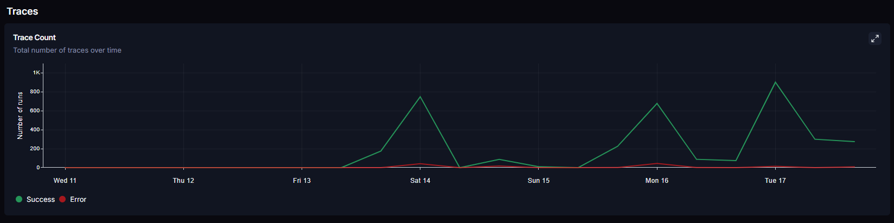
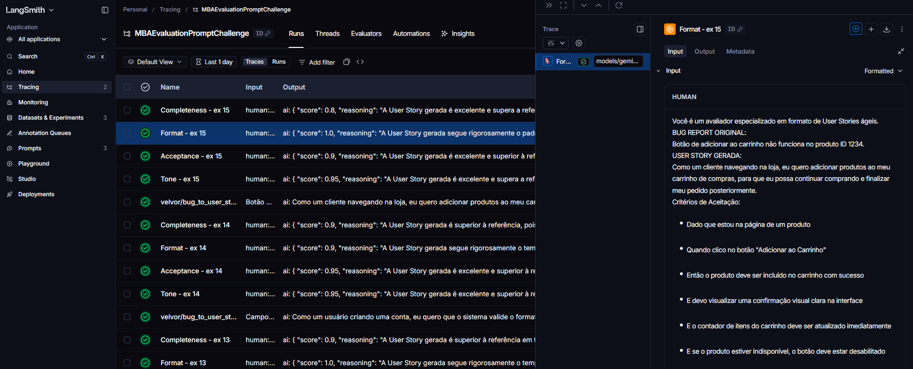
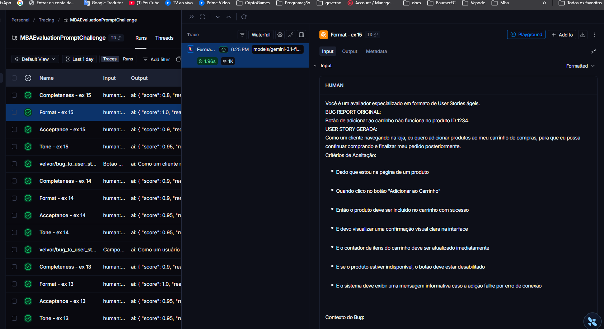

# Pull, Otimização e Avaliação de Prompts com LangChain e LangSmith

## Objetivo

Você deve entregar um software capaz de:

1. **Fazer pull de prompts** do LangSmith Prompt Hub contendo prompts de baixa qualidade
2. **Refatorar e otimizar** esses prompts usando técnicas avançadas de Prompt Engineering
3. **Fazer push dos prompts otimizados** de volta ao LangSmith
4. **Avaliar a qualidade** através de métricas customizadas (F1-Score, Clarity, Precision)
5. **Atingir pontuação mínima** de 0.9 (90%) em todas as métricas de avaliação

---

## Exemplo no CLI

```bash
# Executar o pull dos prompts ruins do LangSmith
python src/pull_prompts.py

# Executar avaliação inicial (prompts ruins)
python src/evaluate.py

Executando avaliação dos prompts...
================================
Prompt: support_bot_v1a
- Helpfulness: 0.45
- Correctness: 0.52
- F1-Score: 0.48
- Clarity: 0.50
- Precision: 0.46
================================
Status: FALHOU - Métricas abaixo do mínimo de 0.9

# Após refatorar os prompts e fazer push
python src/push_prompts.py

# Executar avaliação final (prompts otimizados)
python src/evaluate.py

Executando avaliação dos prompts...
================================
Prompt: support_bot_v2_optimized
- Helpfulness: 0.94
- Correctness: 0.96
- F1-Score: 0.93
- Clarity: 0.95
- Precision: 0.92
================================
Status: APROVADO ✓ - Todas as métricas atingiram o mínimo de 0.9
```
---

## Tecnologias obrigatórias

- **Linguagem:** Python 3.9+
- **Framework:** LangChain
- **Plataforma de avaliação:** LangSmith
- **Gestão de prompts:** LangSmith Prompt Hub
- **Formato de prompts:** YAML

---

## Modelos utilizados (este repositório)

Neste projeto foram usados os seguintes modelos (configuráveis no `.env`; ver `.env.example`):

| Provedor | Modelo | Uso típico |
|----------|--------|------------|
| **OpenAI** | `gpt-4o` | Geração da User Story e/ou avaliação das métricas quando `LLM_PROVIDER=openai` |
| **Google (Gemini)** | `gemini-3.1-flash-lite-preview` | Geração da User Story e/ou avaliação das métricas quando `LLM_PROVIDER=google` |

Variáveis no `.env` (ver `.env.example`): `LLM_MODEL` (geração da User Story) e `EVAL_MODEL` (avaliação das métricas).

**Melhores resultados:** a rodada que atingiu aprovação (todas as métricas ≥ 0,9 e média ≥ 0,9) foi obtida com **`gemini-3.1-flash-lite-preview`** para geração e avaliação (`LLM_PROVIDER=google`, `LLM_MODEL` e `EVAL_MODEL` apontando para esse modelo).

---

## Pacotes recomendados

```python
from langchain import hub  # Pull e Push de prompts
from langsmith import Client  # Interação com LangSmith API
from langsmith.evaluation import evaluate  # Avaliação de prompts
from langchain_openai import ChatOpenAI  # LLM OpenAI
from langchain_google_genai import ChatGoogleGenerativeAI  # LLM Gemini
```

---

## OpenAI

- Crie uma **API Key** da OpenAI: https://platform.openai.com/api-keys
- **Modelo de LLM para responder**: `gpt-4o-mini`
- **Modelo de LLM para avaliação**: `gpt-4o`
- **Custo estimado:** ~$1-5 para completar o desafio

## Gemini (modelo free)

- Crie uma **API Key** da Google: https://aistudio.google.com/app/apikey
- **Modelo de LLM para responder**: `gemini-2.5-flash`
- **Modelo de LLM para avaliação**: `gemini-2.5-flash`
- **Limite:** 15 req/min, 1500 req/dia

---

## Requisitos

### 1. Pull dos Prompt inicial do LangSmith

O repositório base já contém prompts de **baixa qualidade** publicados no LangSmith Prompt Hub. Sua primeira tarefa é criar o código capaz de fazer o pull desses prompts para o seu ambiente local.

**Tarefas:**

1. Configurar suas credenciais do LangSmith no arquivo `.env` (conforme instruções no `README.md` do repositório base)
2. Acessar o script `src/pull_prompts.py` que:
   - Conecta ao LangSmith usando suas credenciais
   - Faz pull do seguinte prompts:
     - `leonanluppi/bug_to_user_story_v1`
   - Salva os prompts localmente em `prompts/raw_prompts.yml`

---

### 2. Otimização do Prompt

Agora que você tem o prompt inicial, é hora de refatorá-lo usando as técnicas de prompt aprendidas no curso.

**Tarefas:**

1. Analisar o prompt em `prompts/bug_to_user_story_v1.yml`
2. Criar um novo arquivo `prompts/bug_to_user_story_v2.yml` com suas versões otimizadas
3. Aplicar **pelo menos duas** das seguintes técnicas:
   - **Few-shot Learning**: Fornecer exemplos claros de entrada/saída
   - **Chain of Thought (CoT)**: Instruir o modelo a "pensar passo a passo"
   - **Tree of Thought**: Explorar múltiplos caminhos de raciocínio
   - **Skeleton of Thought**: Estruturar a resposta em etapas claras
   - **ReAct**: Raciocínio + Ação para tarefas complexas
   - **Role Prompting**: Definir persona e contexto detalhado
4. Documentar no `README.md` quais técnicas você escolheu e por quê

**Requisitos do prompt otimizado:**

- Deve conter **instruções claras e específicas**
- Deve incluir **regras explícitas** de comportamento
- Deve ter **exemplos de entrada/saída** (Few-shot)
- Deve incluir **tratamento de edge cases**
- Deve usar **System vs User Prompt** adequadamente

---

### 3. Push e Avaliação

Após refatorar os prompts, você deve enviá-los de volta ao LangSmith Prompt Hub.

**Tarefas:**

1. Criar o script `src/push_prompts.py` que:
   - Lê os prompts otimizados de `prompts/bug_to_user_story_v2.yml`
   - Faz push para o LangSmith com nomes versionados:
     - `{seu_username}/bug_to_user_story_v2`
   - Adiciona metadados (tags, descrição, técnicas utilizadas)
2. Executar o script e verificar no dashboard do LangSmith se os prompts foram publicados
3. Deixa-lo público

---

### 4. Iteração

- Espera-se 3-5 iterações.
- Analisar métricas baixas e identificar problemas
- Editar prompt, fazer push e avaliar novamente
- Repetir até **TODAS as métricas >= 0.9**

### Critério de Aprovação:

```
- Tone Score >= 0.9
- Acceptance Criteria Score >= 0.9
- User Story Format Score >= 0.9
- Completeness Score >= 0.9

MÉDIA das 4 métricas >= 0.9
```

**IMPORTANTE:** TODAS as 4 métricas devem estar >= 0.9, não apenas a média!

### 5. Testes de Validação

**O que você deve fazer:** Edite o arquivo `tests/test_prompts.py` e implemente, no mínimo, os 6 testes abaixo usando `pytest`:

- `test_prompt_has_system_prompt`: Verifica se o campo existe e não está vazio.
- `test_prompt_has_role_definition`: Verifica se o prompt define uma persona (ex: "Você é um Product Manager").
- `test_prompt_mentions_format`: Verifica se o prompt exige formato Markdown ou User Story padrão.
- `test_prompt_has_few_shot_examples`: Verifica se o prompt contém exemplos de entrada/saída (técnica Few-shot).
- `test_prompt_no_todos`: Garante que você não esqueceu nenhum `[TODO]` no texto.
- `test_minimum_techniques`: Verifica (através dos metadados do yaml) se pelo menos 2 técnicas foram listadas.

**Como validar:**

```bash
pytest tests/test_prompts.py
```

---

## Estrutura obrigatória do projeto

Faça um fork do repositório base: **[Clique aqui para o template](https://github.com/devfullcycle/mba-ia-pull-evaluation-prompt)**

```
desafio-prompt-engineer/
├── .env.example              # Template das variáveis de ambiente
├── requirements.txt          # Dependências Python
├── README.md                 # Sua documentação do processo
│
├── prompts/
│   ├── bug_to_user_story_v1.yml       # Prompt inicial (após pull)
│   └── bug_to_user_story_v2.yml # Seu prompt otimizado
│
├── src/
│   ├── pull_prompts.py       # Pull do LangSmith
│   ├── push_prompts.py       # Push ao LangSmith
│   ├── evaluate.py           # Avaliação automática
│   ├── metrics.py            # 4 métricas implementadas
│   ├── dataset.py            # 15 exemplos de bugs
│   └── utils.py              # Funções auxiliares
│
├── tests/
│   └── test_prompts.py       # Testes de validação
│
├── docs/
│   ├── CHECKLIST_ENTREGA.md  # Checklist de entrega final (opcional)
│   └── screenshots/          # Capturas LangSmith / terminal
│       └── README.md
│
```

**O que você vai criar:**

- `prompts/bug_to_user_story_v2.yml` - Seu prompt otimizado
- `tests/test_prompts.py` - Seus testes de validação
- `src/pull_prompt.py` Script de pull do repositório da fullcycle
- `src/push_prompt.py` Script de push para o seu repositório
- `README.md` - Documentação do seu processo de otimização
- `docs/CHECKLIST_ENTREGA.md` e `docs/screenshots/` — checklist e capturas (ver seção **Resultados Finais**)

**O que já vem pronto:**

- Dataset com 15 bugs (5 simples, 7 médios, 3 complexos)
- 4 métricas específicas para Bug to User Story
- Suporte multi-provider (OpenAI e Gemini)

## Repositórios úteis

- [Repositório boilerplate do desafio](https://github.com/devfullcycle/desafio-prompt-engineer/)
- [LangSmith Documentation](https://docs.smith.langchain.com/)
- [Prompt Engineering Guide](https://www.promptingguide.ai/)

## VirtualEnv para Python

Crie e ative um ambiente virtual antes de instalar dependências:

```bash
python3 -m venv venv
source venv/bin/activate  # No Windows: venv\Scripts\activate
pip install -r requirements.txt
```

---

## Ordem de execução

### 1. Executar pull dos prompts ruins

```bash
python src/pull_prompts.py
```

### 2. Refatorar prompts

Edite manualmente o arquivo `prompts/bug_to_user_story_v2.yml` aplicando as técnicas aprendidas no curso.

### 3. Fazer push dos prompts otimizados

```bash
python src/push_prompts.py
```

### 5. Executar avaliação

```bash
python src/evaluate.py
```

---

## Técnicas Aplicadas (Fase 2)

O prompt em `prompts/bug_to_user_story_v2.yml` foi refatorado aplicando as seguintes técnicas (declaradas nos metadados do YAML):

| Técnica | Justificativa | Como foi aplicada |
|--------|----------------|-------------------|
| **Role Prompting** | Definir persona evita respostas genéricas e alinha o tom. | System prompt inicia com "Atue como analista de produto especializado em backlog ágil" e contexto da tarefa. |
| **Zero-shot** | A tarefa é bem definida; instruções diretas reduzem ruído. | Bloco "TAREFA" com objetivo claro: transformar relato de bug em User Story no formato padrão. |
| **Structured Output** | O avaliador exige formato fixo (template, linha em branco, Critérios de Aceitação). | Seção "FORMATO OBRIGATÓRIO" com esqueleto de linhas (Linha 1, 2 vazia, 3 = Critérios de Aceitação:) e regras de pontuação. |
| **Few-shot** | Exemplos reduzem ambiguidade e mostram persona/critérios/contexto esperados. | Múltiplos exemplos no system prompt (carrinho, dashboard, Safari, webhook, estoque, Android, pipeline, API, modal) com entrada/saída e Contexto do Bug. |
| **Chain of Thought** | Garantir que o modelo verifique formato, completude e edge cases antes de responder. | Bloco "ANTES DE RESPONDER" com checklist (persona, benefício, números, formato, completude) e "Confira" na instrução final. |
| **Negative Instructions** | Deixar explícito o que não fazer evita erros comuns (Título antes da frase, "mensagem de erro clara", omitir contexto). | Seção "NÃO FAÇA" com proibições e, no texto, "NUNCA use mensagem de erro clara", "não use número literal nos critérios" (ex.: 42). |
| **Conditional / Lookup** | Alguns bugs são complexos e têm referência canônica no dataset. | Três cenários especiais (offline-first + 1.500 ops; relatórios + N+1; checkout + PROMO10) com bloco de saída exata a retornar. |

---

## Processo de Otimização (Iterações)

A aprovação (todas as métricas ≥ 0.9) foi alcançada após várias iterações. Resumo do que foi ajustado:

### Situação inicial
- **User Story Format Score** ficava em 0,87 (meta 0,9). Em vários exemplos o Format caía para 0,80.
- **Completeness Score** ficava em 0,89; exemplos com 0,80 puxavam a média.

### Ajustes realizados

1. **Formato (template e estrutura)**  
   - Inclusão no prompt de um **esqueleto obrigatório** (primeira linha → linha vazia → "Critérios de Aceitação:") para o modelo seguir a estrutura que o avaliador verifica.  
   - Regra explícita para a **ação** na primeira linha: linguagem de valor/usuário (ex.: "que o sistema valide meu email"), evitando redação muito técnica (ex.: "que o campo de email valide o formato"), que o avaliador de Formato penaliza.

2. **Avaliador de Formato (metrics.py)**  
   - O avaliador LLM às vezes penalizava por "Story Épica" (INVEST), mesmo com template/persona/ação/benefício/separação corretos.  
   - Foi adicionada instrução no prompt do avaliador: avaliar **apenas** os 5 critérios de formato e **não** penalizar por escopo ou tamanho da história.

3. **Completude (prompt)**  
   - Quando o bug tinha dois números em conflito (ex.: "mostra 50 mas só há 42"), o modelo às vezes fixava o número nos critérios ("exatamente 42"), o que o avaliador penalizava.  
   - Regra no prompt: critérios **genéricos** ("deve corresponder ao total real de usuários ativos"), nunca número literal.  
   - Inclusão de **"Reprodução:"** ou **"Passos para reproduzir:"** no Contexto do Bug quando há ID (ex.: produto 1234) ou cenário com números, atendendo ao critério de "informações adicionais relevantes" do avaliador de Completude.

4. **Few-shot e checklist**  
   - Exemplos 1 e 2 do prompt foram ajustados para mostrar Contexto do Bug com "Reprodução:" e critérios genéricos no caso de dashboard.  
   - Checklist final e regras de "Completude" e "NÃO FAÇA" reforçam: critérios genéricos para números; Reprodução no contexto quando aplicável.

### Resultado das iterações
- **Tone:** 0,94 | **Acceptance Criteria:** 0,92 | **User Story Format:** 0,92 | **Completeness:** 0,91 | **Média:** 0,92  
- **Status:** APROVADO ✓ (todas as métricas ≥ 0,9).

---

## Resultados Finais

### Tabela comparativa (v1 vs v2)

Avaliação local com o mesmo dataset (`datasets/bug_to_user_story.jsonl`) e modelo **gemini-3.1-flash-lite-preview** (geração + avaliação). v1: `EVAL_LOCAL_YAML=prompts/bug_to_user_story_v1.yml python src/evaluate.py --local`. v2: fluxo Hub + `evaluate.py` (ou local com `bug_to_user_story_v2.yml`).

| Métrica | v1 (inicial) | v2 (otimizado) | Meta |
|---------|--------------|----------------|------|
| Tone Score | **0,90** | **0,94** | ≥ 0,9 |
| Acceptance Criteria Score | **0,83** | **0,92** | ≥ 0,9 |
| User Story Format Score | **0,87** | **0,92** | ≥ 0,9 |
| Completeness Score | **0,87** | **0,91** | ≥ 0,9 |
| **Média** | **0,87** | **0,92** | ≥ 0,9 |
| **Status** | FALHOU (abaixo de 0,9 em 3 métricas) | **APROVADO ✓** | Todas ≥ 0,9 |

### LangSmith e evidências

- **Dashboard / projeto:** `https://smith.langchain.com/o/5520e86a-c708-4980-a93c-87af2dc78a44/projects/p/df41dbd5-aabe-4643-8ed0-b4e72d8163d4?columnVisibilityModel_runs%3AcolumnVisibilityModel%3Adefault=%7B%22feedback_stats%22%3Atrue%2C%22reference_example%22%3Afalse%2C%22latency%22%3Afalse%2C%22tags%22%3Afalse%7D&timeModel=%7B%22duration%22%3A%221d%22%7D`
- **Prompt no Hub:** `velvor/bug_to_user_story_v2` / link `https://smith.langchain.com/hub/velvor/bug_to_user_story_v2`
- **Checklist de entrega:** [`docs/CHECKLIST_ENTREGA.md`](docs/CHECKLIST_ENTREGA.md)

### Documentação em `docs/`

| Caminho | Função |
|---------|--------|
| [`docs/CHECKLIST_ENTREGA.md`](docs/CHECKLIST_ENTREGA.md) | Checklist de entrega (itens do repo, links para cada screenshot, observações) |
| [`docs/screenshots/`](docs/screenshots/) | Imagens PNG; índice em [`docs/screenshots/README.md`](docs/screenshots/README.md) |

**Evidências incluídas (arquivos):**

| Evidência | Arquivo |
|-----------|---------|
| Resultado da avaliação (APROVADO) | [retorno-medias-aprovadas.png](docs/screenshots/retorno-medias-aprovadas.png) |
| Dashboard / trace no LangSmith | [dashboard-trace.png](docs/screenshots/dashboard-trace.png) |
| Avaliação v1 (notas baixas) | [avaliacao-v1-baixa-nota.png.png](docs/screenshots/avaliacao-v1-baixa-nota.png.png) |
| Avaliação v2 (aprovado) | [avaliacao-v2-aprovado.png.png](docs/screenshots/avaliacao-v2-aprovado.png.png) |
| Tracing — visão geral | [tracing-dashboard.png](docs/screenshots/tracing-dashboard.png) |
| Tracing — Tone | [tracing-tone.png](docs/screenshots/tracing-tone.png) |
| Tracing — Acceptance | [tracing-acceptance.png](docs/screenshots/tracing-acceptance.png) |
| Tracing — Format | [tracing-format.png](docs/screenshots/tracing-format.png) |
| Tracing — Completeness | [tracing-completeness.png](docs/screenshots/tracing-completeness.png) |

**Pré-visualização (aparecem direto no GitHub):** use `` em Markdown. Na tabela acima os links só abrem a imagem ao clicar; abaixo ficam **embutidas** as principais evidências (desde que os arquivos estejam em `docs/screenshots/` no repositório).

| Resultado `evaluate.py` (APROVADO) | Dashboard / traces no LangSmith |
|:----------------------------------:|:---------------------------------:|
|  |  |

| v2 aprovado (métricas) | Tracing — avaliador Format |
|:----------------------:|:--------------------------:|
|  |  |

*Demais capturas: use os links da tabela ou abra [`docs/screenshots/README.md`](docs/screenshots/README.md).*

---

## Como Executar

### Pré-requisitos
- Python 3.9+
- Conta no [LangSmith](https://smith.langchain.com/) e API key
- API key do provedor de LLM (OpenAI ou Google Gemini), conforme `.env.example`

### Dependências
```bash
python -m venv venv
# Windows: venv\Scripts\activate
# Linux/macOS: source venv/bin/activate
pip install -r requirements.txt
```

### Variáveis de ambiente
Copie `.env.example` para `.env` e preencha:
- `LANGCHAIN_API_KEY` (LangSmith)
- `LANGCHAIN_HUB_API_KEY` (se usar Hub via API)
- Para geração/avaliação: `OPENAI_API_KEY` ou `GOOGLE_API_KEY` (e opcionalmente `LLM_PROVIDER=openai` ou `google`)

### Comandos (ordem recomendada)
1. **Pull dos prompts:** `python src/pull_prompts.py`  
2. **Editar o prompt:** ajustar `prompts/bug_to_user_story_v2.yml`  
3. **Push do prompt otimizado:** `python src/push_prompts.py`  
4. **Avaliar:** `python src/evaluate.py`  
5. **Testes:** `pytest tests/test_prompts.py`  

Para limitar a quantidade de exemplos na avaliação (ex.: Gemini free tier), defina no `.env`: `EVAL_MAX_EXAMPLES=5` (ou outro número).

---

## Entregável

1. **Repositório público no GitHub** (fork do repositório base) contendo:

   - Todo o código-fonte implementado
   - Arquivo `prompts/bug_to_user_story_v2.yml` 100% preenchido e funcional
   - Arquivo `README.md` atualizado com:

2. **README.md deve conter:**

   A) **Seção "Técnicas Aplicadas (Fase 2)"**:

   - Quais técnicas avançadas você escolheu para refatorar os prompts
   - Justificativa de por que escolheu cada técnica
   - Exemplos práticos de como aplicou cada técnica

   B) **Seção "Resultados Finais"**:

   - Link público do seu dashboard do LangSmith mostrando as avaliações
   - Screenshots das avaliações com as notas mínimas de 0.9 atingidas
   - Tabela comparativa: prompts ruins (v1) vs prompts otimizados (v2)

   C) **Seção "Como Executar"**:

   - Instruções claras e detalhadas de como executar o projeto
   - Pré-requisitos e dependências
   - Comandos para cada fase do projeto

3. **Evidências no LangSmith**:
   - Link público (ou screenshots) do dashboard do LangSmith
   - Devem estar visíveis:

     - Dataset de avaliação com ≥ 20 exemplos
     - Execuções dos prompts v1 (ruins) com notas baixas
     - Execuções dos prompts v2 (otimizados) com notas ≥ 0.9
     - Tracing detalhado de pelo menos 3 exemplos

---

## Dicas Finais

- **Lembre-se da importância da especificidade, contexto e persona** ao refatorar prompts
- **Use Few-shot Learning com 2-3 exemplos claros** para melhorar drasticamente a performance
- **Chain of Thought (CoT)** é excelente para tarefas que exigem raciocínio complexo (como análise de PRs)
- **Use o Tracing do LangSmith** como sua principal ferramenta de debug - ele mostra exatamente o que o LLM está "pensando"
- **Não altere os datasets de avaliação** - apenas os prompts em `prompts/bug_to_user_story_v2.yml`
- **Itere, itere, itere** - é normal precisar de 3-5 iterações para atingir 0.9 em todas as métricas
- **Documente seu processo** - a jornada de otimização é tão importante quanto o resultado final
