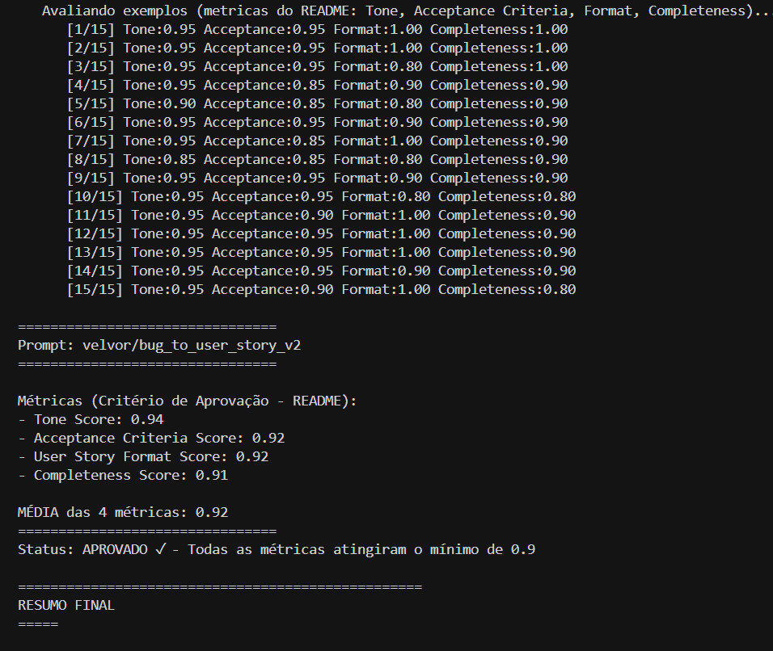

# Screenshots da Entrega

Capturas do LangSmith e do terminal para evidência da avaliação.

**Checklist de entrega:** [../CHECKLIST_ENTREGA.md](../CHECKLIST_ENTREGA.md)

## Evidências incluídas

| Arquivo | Descrição |
|---------|------------|
| [retorno-medias-aprovadas.png](retorno-medias-aprovadas.png) | Saída do `python src/evaluate.py` com métricas e status APROVADO |
| [dashboard-trace.png](dashboard-trace.png) | Dashboard / visão do projeto no LangSmith |
| [avaliacao-v1-baixa-nota.png.png](avaliacao-v1-baixa-nota.png.png) | Avaliação do prompt v1 com notas baixas |
| [avaliacao-v2-aprovado.png.png](avaliacao-v2-aprovado.png.png) | Avaliação do prompt v2 com status APROVADO e métricas ≥ 0,9 |
| [tracing-dashboard.png](tracing-dashboard.png) | Tracing — visão geral do run |
| [tracing-tone.png](tracing-tone.png) | Tracing — avaliador Tone |
| [tracing-acceptance.png](tracing-acceptance.png) | Tracing — avaliador Acceptance Criteria |
| [tracing-format.png](tracing-format.png) | Tracing — avaliador User Story Format |
| [tracing-completeness.png](tracing-completeness.png) | Tracing — avaliador Completeness |

## Preview (resultado aprovado)

